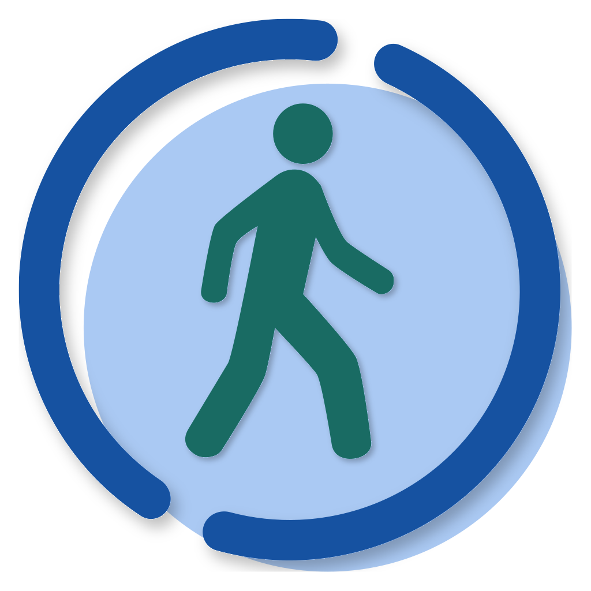

<!-- Logo and badges -->

<picture>
  <source media="(prefers-color-scheme: dark)" srcset=".github/images/icon-dark.svg">
  <source media="(prefers-color-scheme: light)" srcset=".github/images/icon.svg">
  
</picture>

 
 

  

<!-- Title and summary -->

    <h1>Casey Walks</h1>
    <h4>A simple walk planner for the City of Casey made for the Livable Cities Audit Swinburne capstone project.</h4>
    
    

<!-- Table of contents -->

    
Table of Contents

    <ol>
        <li><a href="#overview">Overview</a></li>
        <li>
            <a href="#features">Features</a>
            <ul><li><a href="#screenshots">Screenshots</a></li></ul>
        </li>
        <li><a href="#getting-started">Getting Started</a></li>
        <li><a href="#usage">Usage</a></li>
        <li><a href="#build">Build</a></li>
        <li><a href="#privacy">Privacy</a></li>
        <li><a href="#license">License</a></li>
        <li><a href="#ai-usage-declaration">AI Usage</a></li>
        <li><a href="#acknowledgements">Acknowledgements</a></li>
    </ol>

## Overview
Casey Walks is a simple walk planning app for the City of Casey community to be able to plan and share walking routes in their local area. It allows people to view various public utilities, facilities, and features within the City of Casey and generate walking routes including these points of interest. The app also includes a simple walk counter and community sharing features.

This app was created for a Swinburne University of Technology capstone project which aimed to operationalise the data available in the City of Casey [Open Data Exchange](https://data.casey.vic.gov.au/), as well as encourage other developers to use this data in their own existing or new projects.

## Features
- A map of the City of Casey showing various amenities including:
    - Barbecues
    - Benches
    - Drinking fountains
    - Libraries
    - Public toilets
- Custom walk route creation featuring:
    - Custom walk titles
    - Custom walk distance
    - Selection of walk amenities filters
- A list of the closest nearby amenities
- Community shared walks
- Local weather display
- Weekly walks count tracker and goal
- Account creation for publicly sharing custom walks

### Screenshots
`TODO`
<!--
- main map page w/ bottom sheet at normal (light, dark)
- main map page w/ bottom sheet at up + 2 custom walks (light, dark)
- main map page w/ bottom sheet at up showing nearby + community walks (light, dark)
- profile page logged in (light, dark)
-->

## Getting Started
### Requirements
- Android 7+ or iOS 15.1+ smartphone
- Constant internet access (Wi-Fi or mobile data) while using the app

### Installing
The app can be installed from the Google Play Store or the Apple App Store:  
- `app store links + qr codes`

Additionally, the application files for both Android and iOS can be downloaded from the [latest release](https://github.com/chiragluitel/Liveable-Cities/releases/latest). The Android APK can be installed without much issue, but the iOS IPA will require some form of workaround to install, such as jailbreaking your device. We are not responsible for any issues that arise from sideloading our app.

## Usage
`TODO`

## Build
> Building for iOS can only be done on macOS

> Using Docker is recommended if your system is supported
### Prerequisites
#### With Docker
- Docker Desktop
  - [macOS install requirements](https://docs.docker.com/desktop/setup/install/mac-install/#system-requirements)
  - [Windows install requirements](https://docs.docker.com/desktop/setup/install/windows-install/#system-requirements)
  - [Linux install requirements](https://docs.docker.com/desktop/setup/install/linux/)

#### Without Docker
- Android Studio + Android SDK for Android development
- macOS + Xcode for iOS development
- Node.js (LTS)
- .Net 9
- PostgreSQL 17

### Building
1. Clone the repository
2. Use the [instructions from Expo](https://docs.expo.dev/get-started/set-up-your-environment/) to install and setup the Expo development environment. We recommend using the development build without EAS.
3. Copy `.env.example` to `.env` and fill it with the correct values
4. Run `npm install` in the `/frontend` folder
5. Build and install the development phone client (in the `/frontend` folder):
    - Android emulator or physical device: `npx expo run:android`
        > For physical Android devices, ensure they are connected via USB with USB Debugging enabled. Use `adb devices` to list connected devices
    - iOS simulator: `npx expo run:ios`
    - Physical iOS device: `npx expo run:ios --device`
        > For physical iOS devices, make sure your device is connected and configured for development in Xcode

If using Docker, <ins>**stop the development server**</ins> and continue to the [With Docker](#with-docker-1) section. If you aren't using docker, <ins>**leave the development server running**</ins> and continue to the [Without Docker](#without-docker-1) section.

#### With Docker
1. Install and setup [Docker Desktop](https://www.docker.com/products/docker-desktop/)
2. Inside the project root folder, run `docker compose up --build`
3. Open the Expo development phone client and connect to the development server
    - If the client doesn't connect automatically, either enter the URL of the development server or scan the QR code
        > If the dev server URL contains `localhost`, replace it with the IP address of the device running the server, assuming the phone is on the same network

#### Without Docker
1. Install PostgeSQL 17 with `winget install PostgeSQL.PostgreSQL.17`
2. Install PostGIS 3.5 with the PostgreSQL Application Stack Builder (`Spacial Extensions -> PostGIS 3.5`)
3. Create a new database in the PostgreSQL server
4. Create a new Login/Group role
5. Update the new database to allow the new login to have full permissions
6. Update `DefaultConnection` in `/backend/CaseySmartHub.Api/appsettings.json` to reflect the new database and user values
7. Open a new terminal and navigate to the `/backend/CaseySmartHub.Api` folder
8. Run `dotnet run` to start the backend
    > The mobile app may need to be restarted to connect to the backend

## Privacy
This app uses your location data temporarily to calculate walking routes. Your location is discarded after route calculation.

If you create an account, your username and securely hashed password are stored to authenticate you and allow you to upload custom walking routes. Uploaded routes are publicly visible to anyone using the app.

For full details about how information is handled, see the full [Privacy Notice](PRIVACY.md).

## License
This application is distributed under the MIT License. See [LICENSE](LICENSE) for more information.

## AI Usage Declaration
Generative AI tools were used to assist with the development of this project, primarily for learning and understanding new tools and libraries, as well as assisting with debugging and resolving some merge conflicts. All AI-generated responses were reviewed, tested, and modified by the development team to ensure the quality of the code used in this project. Only a small amount of the code used in this project was entirely or mostly generated by AI.

## Acknowledgements
This project was developed for a Swinburne University of Technology capstone project in collaboration with the City of Casey.

We would like to thank both the City of Casey for maintaining their Open Data Portal and submitting this project as part of the Swinburne capstone program. We also thank Swinburne University of Technology for providing us the opportunity to work on this project and gain real world software development experience.